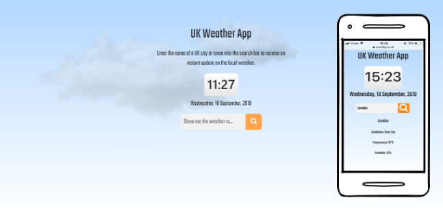

# UK Weather App

This is a simple application designed to provide the user with instant access to up-to-date 
weather conditions in a specified UK region, via use of a search bar.

## How it works

The application uses Javascript logic to connect to an API courtesy of OpenWeatherMap.org, 
retrieving data from it in JSON format. The user is invited to enter a query into the 
searchbar - this can be the name of any UK county, city or town. 

The input is saved as a variable which is used to alter the API call, returning the current 
weather conditions for the specified location. Upon submitting the request, relevant weather 
information - including a description, temperature and humidity - is instantly returned to 
the user interface.

The app also presents the time and date, and uses JavaScript to trigger certain variable CSS 
features, which alter the page backdrop depending on the time of the day and the weather 
conditions in the specified location.

## Technologies used

- JavaScript
	- **JavaScript** was used for all interactive elements of the application, primarily the 
	search query function and several dynamic CSS features
- jQuery
	- **jQuery** was used to make the API call, as well as helping to simplify various other pieces of functionality 
- HTML
    - **HTML** was used to structure the website
- CSS
    - The appearance of the website was enhanced using **CSS**
- Bootstrap
	- The **Bootstrap** front-end framework was used to help give the project a simple, responsive, and mobile-friendly layout

## Try it out

This application is live at: https://samalty.github.io/weather-query-app/
